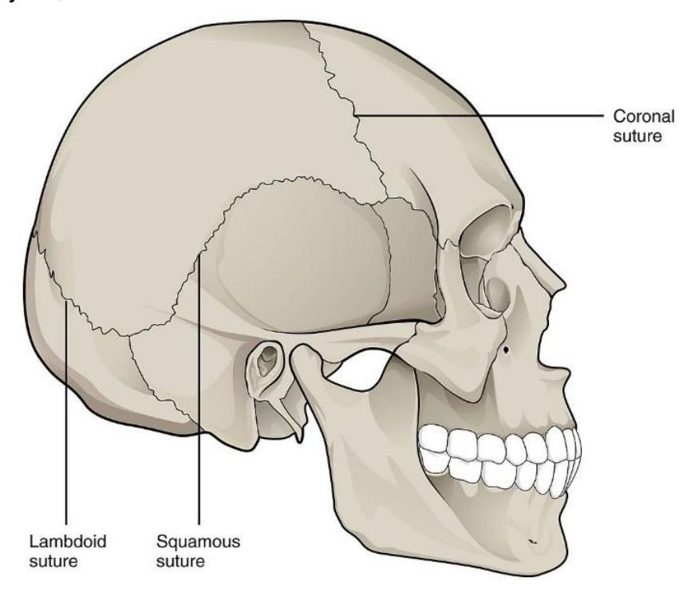
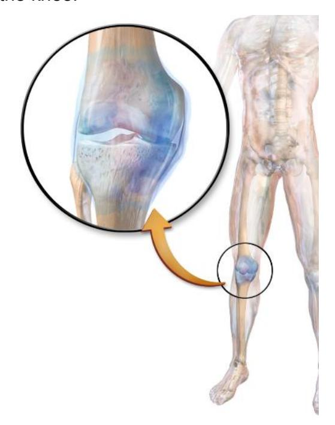
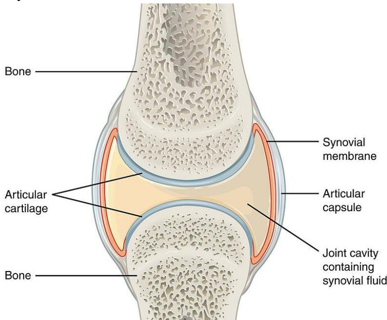
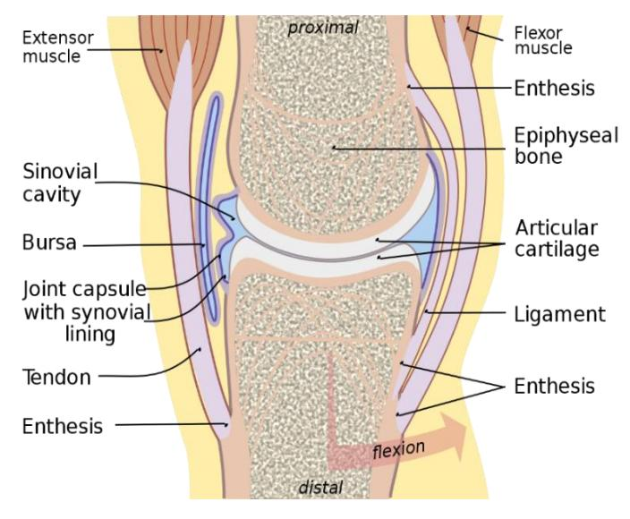
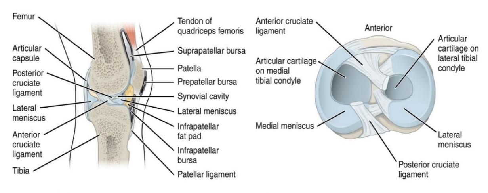
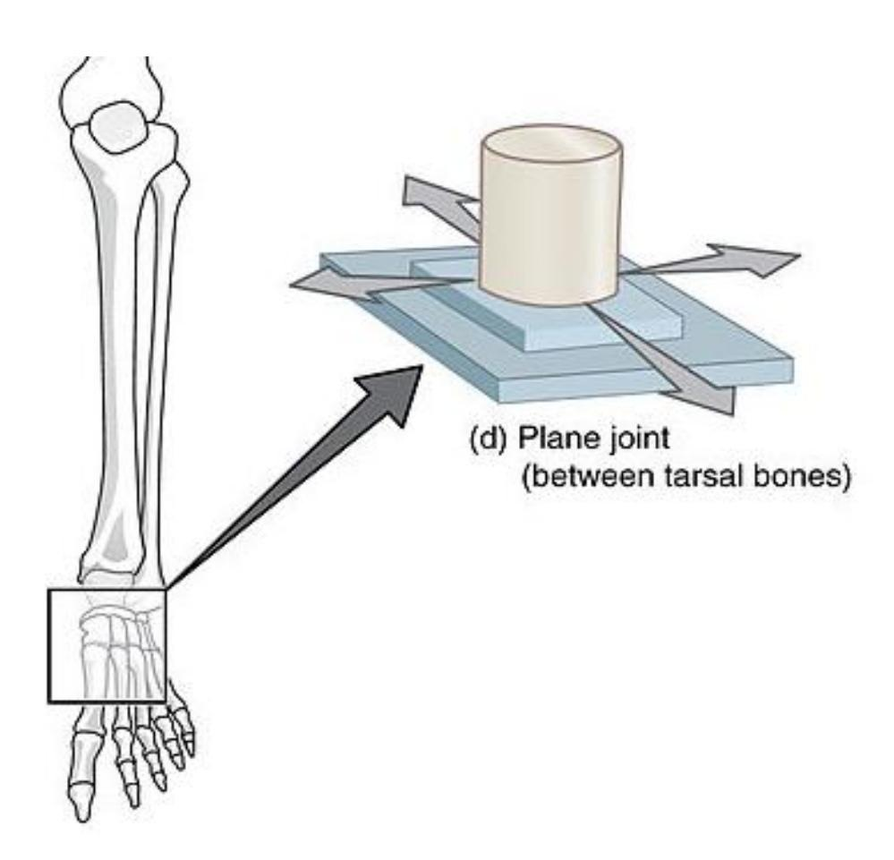
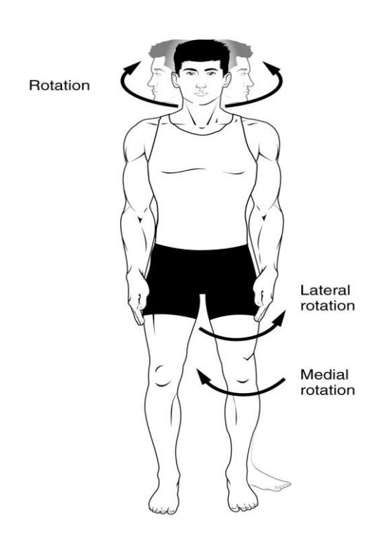
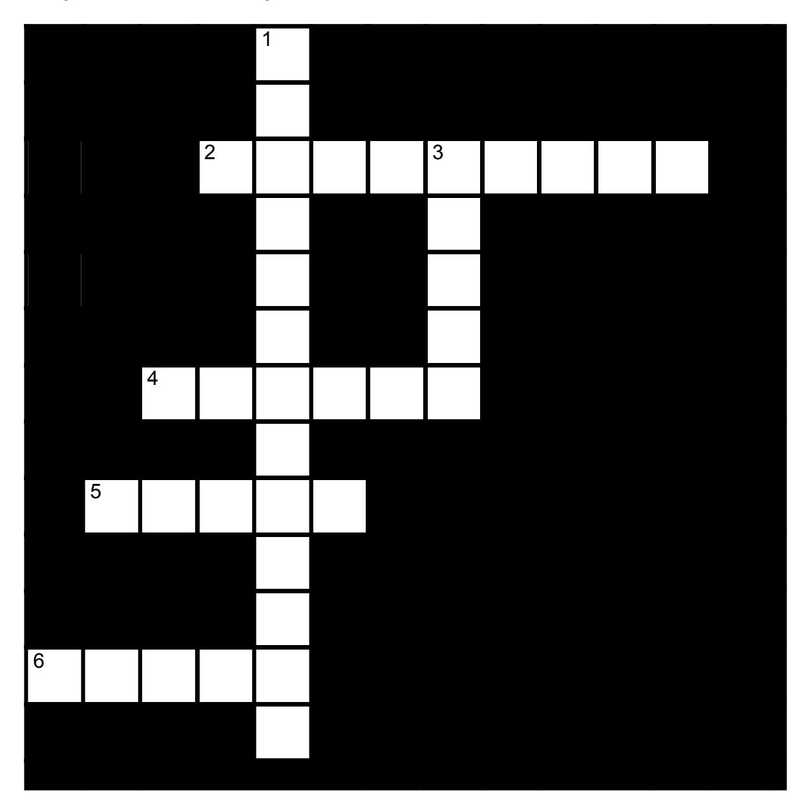

# **The Articulations and Joints:**

## **Lab Summary:**

In this lab you will learn about the articulations and the joints of the skeletal system. On an upcoming test or quiz the identifications and description of the articulations and joints may be based on a model or a diagram of the structure.

## **Joint Classifications:**

## **Functional: Range of Motion**

• Amphiarthrosis • Synarthrosis • Diarthrosis

## **Structural Classification**

• Fibrous joints

- o Syndesmosis
- o Suture
- o Gomphosis

• Cartilaginous joints

- o Synchondrosis
- o Symphysis

• Synovial joints

- o Plane (gliding)
- o Hinge
- o Pivot
- o Condyloid (ellipsoid)
- o Saddle
- o Ball and socket

## **Synovial Joint Components**

- Synovial membrane
- Articular cartilage
- Joint cavity

- Articular cavity
- Bursae

### **Synovial Joint Movements**

- Gliding movements
- Angular movements
  - o Flexion
  - o Extension
  - o Hyperextension
  - o Abduction
  - o Adduction
  - o Circumduction

- Rotational movements
  - o Medial
  - o Lateral
  - o Left
  - o Right

- Special movements
  - o Supination
  - o Pronation
  - o Opposition
  - o Reposition
  - o Eversion
  - o Inversion
  - o Protraction
  - o Retraction
  - o Elevation
  - o Depression
  - o Dorsiflexion
  - o Plantar flexion

## • **Knee Joint Anatomy**

- o Quadriceps tendon
- o Patellar ligament
- o Anterior cruciate ligament
- o Posterior cruciate ligament

- o Tibial (medial) collateral ligament
- o Fibular (lateral) collateral ligament
- o Medial meniscus
- o Lateral meniscus

# **Prelab Activities**

# Prelab Activity 9.1:

## **Definitions**

| • Range                    | Range of motion     |  |
|----------------------------|---------------------|--|
| 0                          | Amphiarthrotic      |  |
| 0                          | Synarthrotic        |  |
| 0                          | Diarthrotic         |  |
| • Fibrou                   | us joints           |  |
| 0                          | Syndesmosis         |  |
| 0                          | Suture              |  |
| 0                          | Gomphosis           |  |
| • Cartila                  | aginous joints      |  |
| 0                          | Synchondrosis       |  |
| 0                          | Symphysis           |  |
| • Synov                    | vial joints         |  |
| Synovial Jo                | int Components      |  |
| • Synov                    | vial membrane       |  |
| 0                          | Articular cartilage |  |
| 0                          | Joint cavity        |  |
| 0                          | Articular cavity    |  |
| 0                          | Bursae              |  |
| Knee Joint                 |                     |  |
| <ul> <li>Quad</li> </ul>   | Quadriceps tendon   |  |
| <ul> <li>Patell</li> </ul> | Patellar ligament   |  |

| Anterior cruciate ligament            |  |
|---------------------------------------|--|
| Posterior cruciate ligament           |  |
| Tibial (medial) collateral ligament   |  |
| Fibular (lateral) collateral ligament |  |
| Medial meniscus                       |  |
| Lateral meniscus                      |  |
|                                       |  |
| Types of Synovial Joint Movements:    |  |
| Gliding movements                     |  |
| Angular movements                     |  |
| o Flexion                             |  |
| o Extension                           |  |
| Hyperextension                        |  |
| o Abduction                           |  |
| o Adduction                           |  |
| o Circumduction                       |  |
| Rotational movements                  |  |
| o Medial                              |  |
| o Lateral                             |  |
| o Right                               |  |
| o Left                                |  |
| Special movements                     |  |
|                                       |  |
| Supination                            |  |
| o Pronation                           |  |

| 0 | Opposition      |
|---|-----------------|
| 0 | Reposition      |
| 0 | Eversion        |
| 0 | Inversion       |
|   | Protraction     |
|   | Retraction      |
| 0 | Elevation       |
| 0 | Depression      |
| 0 | Dorsiflexion    |
| 0 | Plantar flexion |

# Prelab Activity 9.2

## Fill in the table.

From your text, p. 180, complete the table below.

Table 9.1 Table of Synovial Joints, their Motion and Location

| Synovial joint types      | Motion type | Location |
|---------------------------|-------------|----------|
| plane joints (gliding) |             |          |
| ball and socket joints |             |          |
| hinge joints              |             |          |
| pivot joints              |             |          |
| condyloid joints          |             |          |
| saddle joints             |             |          |

## **Lab Activities**

## **Joint Structure and Movements**

## **Classification of Joints:**

## **Activity 9.1**

## **Classification of the joints**

In this exercise the objective is to do the following:

- Form into your study groups
- Get an articulated skeleton from the storage area.
- Locate the joints of the body based on their range of motion.
- Review figures 9.1 to 9.3.
- Identify and label each type of joint based on their range of motion.
- Have your neighbor lab group review your work for correctness.
- Take pictures for your later review.

## **Functional classification based on range of motion.**

- synarthrosis amphiarthrosis diarthrotic

## **Synarthrosis**

A non-movable joint, such as the suture in the skull.

**Figure 9.1** Synarthrosis Joints (e.g., the Sutures),

## **Amphiarthrosis**

Slightly moveable joints: for example, joints of the vertebral column.

**Figure 9.2** Posterolateral View of Vertebrae, Labelled Description.

## **Diarthrosis**

A freely mobile joint is classified as diarthrosis. An example would be any of the synovial joints such as the knee.

**Figure 9.3** A Medical Illustration Depicting the Synovial Joint.

## **Classification of joints based on their Structure.**

## **Lab Activity 9.2**

In this exercise the objective is to do the following:

- Working in your lab groups, obtain an articulated skeleton from the storage area.
- Locate the joints of the body based on their structure. (use figures 9.4 to 9.8).
- Identify and label each type of joint based on their range of motion.
- Photograph and label for your later review.

## • **Cartilaginous joints**

- o Synchondrosis
- o Symphysis

## • **Fibrous joints**

- o Suture
- o Syndesmosis

• **Synovial joints** 

o Gomphosis

• •

**Figure 9.4** Types of Joints Based upon their Structure (L to R: Cartilaginous Joint, Fibrous Joint, and Synovial Joint).

## **Cartilaginous Joints**

- Symphyses: a fibrocartilaginous fusion between two bones. (e.g., Pubic Symphysis)
- Synchrondroses: bones joined by hyaline cartilage (ex. Epiphyseal Plate)

**Figure 9.5** Examples of Cartilaginous Joints.

## **Fibrous Joints**

- Sutures joint between the bones of the skull
- Syndesmosis joint between two parallel articulating bones such as the ulna and radius.
- Gomphosis joint between the tooth and the alveolus or the mandible or maxillae. Held together by periodontal ligaments.

**Figure 9.6** Examples of Fibrous Joints. (a. suture, b. syndesmosis, c. gomphosis).

## **Synovial Joints**

## **Synovial Joint structure**

- Synovial membrane/lining
- Articular cartilage
- Joint cavity

- Articular (synovial) cavity
- Bursa

**Figure 9.7** Synovial joint.

**Figure 9.8** General View of a Synovial Joint (Medial Aspect).

In this exercise the objective is to do the following:

- Locate the synovial joints of the body based on their structure on an articulated skeleton.
- Identify and label each type of joint based on their function.
- Photograph and label for your later review.

## **Synovial Joints: Types of Synovial Joints**

a) Pivot

c) Saddle

e) Condyloid

f) Ball and socket

b) Hinge

- d) Plane (gliding)

**Figure 9.9** Types of Synovial Joints.

## **Knee Joint Anatomy**

- Quadriceps tendon
- Patellar ligament
- Anterior cruciate ligament
- Posterior cruciate ligament
- Tibial (medial) collateral ligament
- Fibular (lateral) collateral ligament
- Medial meniscus
- Lateral meniscus

## **Lab Activity 9.4**

This activity you will work as groups to identify the anatomy of the human knee. (figure 9.10)

- Go to the storage area and obtain a model of the knee. The terms listed above are those you are expected to know and identify on the model.
- Using colored labelling tape write down the term above and attach it to the model. When complete check with your Instructor on your accuracy.

**Figure 9.10** Knee Joint.

## **Types of Synovial Joints Movement**

**Synovial Joint Movements: (figures 9.11 to 9.16)**

## **Activity 9.5**

In this section you will review and identify the movements of the synovial joints. You will be required to identify these movements from a picture or by defining the movement. Take care to be able to identify where this type of movement is located on the body.

## **Gliding Movements**

**Figure 9.11** Gliding Movement.

## **Angular Movements**

- Flexion
- Extension
- Hyperextension
- Abduction
- Adduction
- Circumduction

**Figure 9.12** Angular Movements of Synovial Joints; Flexion and Extension of the Body Appendages and the Head.

**Figure 9.13** Angular Movements – Abduction, Adduction, and Circumduction.

## **Rotational Movements**

- Medial
- Lateral

- Left
- Right

**Figure 9.14** Rotation of the Head and Neck, and Lower Limb.

## **Special Movements**

- Protraction
- Elevation

• Opposition

- Retraction
- Depression
- Reposition

**Figure 9.15.** Special Movements. (Protraction and Retraction of the Mandible, Elevation and Depression of the Mandible, and Opposition and Reposition of the Fingers).

## **Special Movements continued**

- Pronation
- Supination

- Dorsiflexion
- Plantar flexion
- Inversion
- Eversion

**Figure 9.16** Special Movements: Pronation and Supination of the Hand, Dorsiflexion and Plantar Flexion of the Foot, and Inversion and Eversion of the Foot.

## **Additional Learning Resources**

- Types of joints in the human body Anatomy & Examples by KenHub <https://youtu.be/bfiUnhAHt8Q>
- Joints by Fuse School <https://youtu.be/NF51ioK6U14>
- The 6 Types of Joints Human Anatomy for Artists [https://youtu.be/0cYal\\_hitz4](https://youtu.be/0cYal_hitz4)
- Joints: by Crash Course; Anatomy & Physiology #20 [https://youtu.be/DLxYDoN634c.](https://youtu.be/DLxYDoN634c) We continue our look at your bones and skeletal system, skipping over the silly kid's song in favor of a more detailed look at your axial and appendicular skeleton. This episode also talks about the structural and functional classifications of your joints and the major types of body movement that they facilitate.
- Types of Synovial Joints <https://youtu.be/dJZz7hBoALs>
- Body Movement and Terms Anatomy | Body Planes of Motion | Synovial Joint Movement Terminology <https://youtu.be/KO4nUzO7xoo>
- Joint Movements by [Dr. Matt & Dr. Mike](file:///E:/%23%202023-109%20lab%20manual/2023%20manual/Latest%20versions/Dr.%20Matt%20&%20Dr.%20Mike) <https://youtu.be/tAJjXvumL7E>
- Joints & Joint Movements; Skeletal System Anatomy & Physiology by [Mike](https://www.youtube.com/@miketylersport)  [Tyler,](https://www.youtube.com/@miketylersport) [https://youtu.be/z4dS\\_7NNSok](https://youtu.be/z4dS_7NNSok)
- Types of Synovial Joints<https://youtu.be/dJZz7hBoALs>

## **Post Lab Activities Check Your Understanding:**

**Post Lab Activity 9.1: crossword puzzle**

**Complete the crossword puzzle below.**

**Figure 9.17** The Articulations.

- **2** modified ball-and-socket joints; range of motion is biaxial (9)
- **4** two saddle shaped surfaces at right angles; biaxial movement (6)
- **5** cylindrical process rotates within a ring: monaxial rotation (5)
- **6** convex cylinder applied to a concavity; monoaxial movement (5)

- **1** round head fitting into a round depression; multiaxial (4-3-6)
- **3** Two opposed flat surfaces approximately equal in size; monaxial movement is gliding or slightly twisting (5)

## **Matching**

**Table 9.2 Match the Correct Term with the Definition to the Left**

| Answer | Definition                                                                                                                                                                                                                                                  | Term                                                  |
|--------|-------------------------------------------------------------------------------------------------------------------------------------------------------------------------------------------------------------------------------------------------------------|-------------------------------------------------------|
|        | 1. A(n), or joint, is any site where two bones meet.                                                                                                                                                                                                  | a. diarthrotic                                     |
|        | 2. The three functional classifications for joints are,, and                                                                                                                                                                                          | b. synovial                                        |
|        | 3. A joint that is immobile is a(n) joint.                                                                                                                                                                                                               | c. synarthrotic; fibrous                        |
|        | 4. A joint that allows only a small amount of movement is a(n) joint.                                                                                                                                                                                 | d. Bursae                                          |
|        | 5. A freely movable joint is a(n) joint.                                                                                                                                                                                                                 | e. structure; function                             |
|        | 6. Sutures are joints that are (function) and (structure).                                                                                                                                                                                            | f. synarthrotic; amphiarthrotic; diarthrotic |
|        | 7. Gomphoses are classified as (function) and (structure).                                                                                                                                                                                            | g. synarthrotic                                    |
|        | 8. Most joints in the body are                                                                                                                                                                                                                           | h. fibrous                                         |
|        | 9. are flattened, fibrous sacs lined with synovial membranes and containing synovial fluid.                                                                                                                                                        | i. fibrous; cartilaginous; synovial          |
|        | 10.For joints, there is no joint cavity and the joints themselves are synarthrotic or at most amphiarthrotic. The bones are joined by fibrous connective tissue and their function is more to prevent separation than to resist compression. | j. articulation                                    |
|        | 11.The three structural classifications for joints are ,, and                                                                                                                                                                                            | k. synarthrotic; amphiarthrotic;                |
|        | 12.The three functional classifications for joints are,, and                                                                                                                                                                                             | l. amphiarthrotic                                  |
|        | 13.Joints are classified by two criteria: and                                                                                                                                                                                                            | m. synarthrotic; fibrous                        |

## **Labeling**

Label the following diagrams 9.17 and 9.18.

## **Knee joint anatomy**

- Quadriceps tendon
- Patellar ligament
- Anterior cruciate ligament
- Posterior cruciate ligament
- Tibial (medial) collateral ligament

- Fibular (lateral) collateral ligament
- Medial meniscus
- Lateral meniscus

**Figure 9.18** Anatomy of the Knee, Sagittal View.

**Figure 9.19** Superior View of the Right Tibia.

## **Crossword Answers**

• **Across: 2** Ellipsoid, **4** Saddle, **5** Pivot, **6** Hinge.

• **Down: 1** Ball-and-socket, **3** Plane.

| Chapter 9. The Articulations and Joints Glossary |                                                                                                                                                                                |  |
|--------------------------------------------------|--------------------------------------------------------------------------------------------------------------------------------------------------------------------------------|--|
| Terms                                            | Definitions                                                                                                                                                                    |  |
| abduction                                        | The movement which separates a limb or other part from the axis, or middle line, of the body                                                                                |  |
| adduction                                        | the movement of a limb toward the midline of the body                                                                                                                          |  |
| articular cartilage                              | a type of smooth cartilage found only in diarthrodial joints, where it allows for easy articulation, weight distribution and shock absorption.                              |  |
| articular capsule                                | also known as a joint capsule, is a double-layered structure that surrounds a synovial joint.                                                                               |  |
| Ball and socket joint                            | a type of joint in the body where the rounded end of one bone fits into a cup-like socket of another bone, allowing for a wide range of movement in multiple directions. |  |
| Cartilaginous joint                              | at a cartilaginous joint, the adjacent bones are united by cartilage, a tough but somewhat flexible type of connective tissue.                                              |  |
| Circumduction                                    | a conical movement of a limb extending from the joint at which the movement is controlled.                                                                                  |  |
| Condyloid joint                                  | an ovoid articular surface, or condyle that is received into an elliptical cavity.                                                                                          |  |
| depression                                       | movement in an inferior direction.                                                                                                                                             |  |
| dorsiflexion                                     | Flexion in the dorsal direction.                                                                                                                                               |  |
| elevation                                        | movement in a superior direction (e.g., shoulder shrug)                                                                                                                        |  |
| extension                                        | a movement that increases the angle between two body parts.                                                                                                                    |  |
| eversion                                         | the movement of the sole away from the median plane – so that the sole faces in a lateral direction.                                                                     |  |
| Fibrous cartilage                                | a type of cartilage that contains both fibrous and cartilaginous tissues and is found in some joints and discs.                                                             |  |
| flexion                                          | a movement that decreases the angle between two body parts                                                                                                                     |  |
| Hinge joint                                      | a type of synovial joint that allows movement in one plane, similar to how a door hinge operates.                                                                           |  |
| hyperextension                                   | a joint moving beyond its normal range of motion, often resulting in injury                                                                                                    |  |
| inversion                                        | the movement of the sole towards the median plane – so that the sole faces in a medial direction.                                                                        |  |
| Joint cavity                                     | a fluid-filled space found in synovial joints, which allows for smooth movement between the articulating bones.                                                             |  |
| Knee Joint                                       | the biggest joint in your body that connects your thigh bone to your shin bone.                                                                                             |  |
| Lateral meniscus                                 | a fibrocartilaginous band that spans the lateral side of the interior of the knee joint.                                                                                    |  |
| Medial meniscus                                  | a fibrocartilage semicircular band that spans the knee joint medially, located between the medial condyle of the femur and the medial condyle of the tibia.              |  |
| opposition                                       | brings the thumb and little finger together.                                                                                                                                   |  |
| Patellar ligament                                | also known as the patellar tendon, connects the kneecap (patella) to the tibia                                                                                              |  |
| Pivot joint                                      | a type of synovial joint whose movement axis is parallel to the long axis of the proximal bone, which typically has a convex articular surface.                             |  |

| Plane (gliding) joint        | a type of synovial joint that allows bones to slide past one another in various directions along the plane of the joint                                                                         |
|------------------------------|----------------------------------------------------------------------------------------------------------------------------------------------------------------------------------------------------|
| Plantar flexion              | the movement of pointing your toes away from your body, which occurs when you stand on your tiptoes or press down on a gas pedal                                                                |
| Protraction                  | the anterolateral movement of the scapula on the thoracic wall that allows the shoulder to move anteriorly.                                                                                     |
| Pronation                    | The act of turning a limb, palm, or palmar surface of the forefoot downward.                                                                                                                    |
| Quadriceps tendon            |                                                                                                                                                                                                    |
| retraction                   | the posteromedial movement of the scapula on the thoracic wall, which causes the shoulder region to move posteriorly i.e., picking something up.                                                |
| Rotation (medial/lateral) | rotation describe movement of the limbs around their long axis: medial rotation is a rotational movement towards the midline. Lateral rotation is a rotating movement away from the midline. |
| Saddle joint                 | a type of synovial joint in which the opposing surfaces are reciprocally concave and convex. It is found in the thumb,                                                                          |
| Supination                   | The act of turning the hand palm upward                                                                                                                                                            |
| Synovial joint               | a type of joint in the body that allows for free movement between the bones it connects. It features a fluid-filled cavity, articular cartilage, and a joint capsule.                        |
| Synovial membranes           | specialized connective tissues that line the inner surfaces of synovial joints, such as the knees and elbows. They secrete synovial fluid.                                                      |

